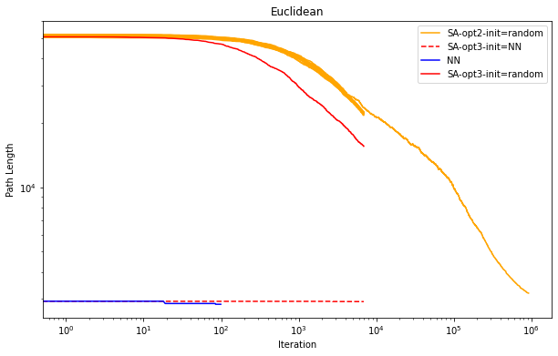
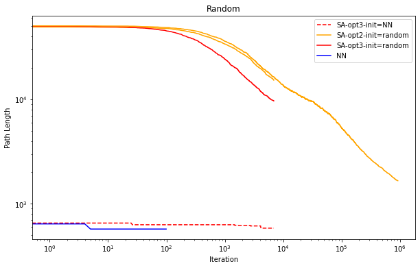

# UCDavis-289Q-HW3

Weyl
03/09/2024


Github repositary: (https://github.com/OamIcs/UCDavis-289Q-HW)


## Algorithm design

I construct a Class `TSP_Solver`  and implement two kinds of heuristic algorithms for TSP: Nearest Neighborhood (NN), Simulated Annealing (SA), and two different local optimization methods: 2-opt and 3-opt, two initialization methods: randomly initialize and initialize with an NN solution for SA algorithm.

 

Here’re pseudo-codes.

### Nearest Neighbor (NN) Algorithm

```
Algorithm NearestNeighbor(TSP_instance)
    Start with an arbitrary city as the current city
    Mark the current city as visited
    While there are unvisited cities
        Find the nearest unvisited city to the current city
        Move to the nearest unvisited city
        Mark the city as visited
    End While
    Return to the starting city
End Algorithm
```


### Simulated Annealing (SA) with 2-opt Moves

```
Algorithm SimulatedAnnealing2opt(TSP_instance, initial_solution, initial_temperature, cooling_rate, stopping_temperature)
    current_solution = initial_solution
    current_temperature = initial_temperature
    While current_temperature > stopping_temperature
        For a number of iterations at current_temperature
            new_solution = Apply2optMove(current_solution)
            delta_cost = Cost(new_solution) - Cost(current_solution)
            If delta_cost < 0 or Random() < exp(-delta_cost / current_temperature)
                current_solution = new_solution
            End If
        End For
        current_temperature = current_temperature * cooling_rate
    End While
    Return current_solution
End Algorithm
```


### Simulated Annealing (SA) with 3-opt Moves

```
Algorithm SimulatedAnnealing3opt(TSP_instance, initial_solution, initial_temperature, cooling_rate, stopping_temperature)
    current_solution = initial_solution
    current_temperature = initial_temperature
    While current_temperature > stopping_temperature
        For a number of iterations at current_temperature
            new_solution = Apply3optMove(current_solution)
            delta_cost = Cost(new_solution) - Cost(current_solution)
            If delta_cost < 0 or Random() < exp(-delta_cost / current_temperature)
                current_solution = new_solution
            End If
        End For
        current_temperature = current_temperature * cooling_rate
    End While
    Return current_solution
End Algorithm
```


+ `initial_solution`  could be generated by random method or NN bootstrap.
+ `TSP_instance` represents the set of cities and distances between them.
+ `GenerateRandomInitialSolution()` creates a random TSP tour as a starting point.
+ `Apply2optMove()` and `Apply3optMove()` are functions that randomly select segments within the current solution and attempt to improve the tour by reversing the order of cities in those segments (for 2-opt) or by considering three segments for reconnection in different ways (for 3-opt).
+ `Cost()` calculates the total distance of the tour.
+ `Random()` generates a random float between 0 and 1, and `exp()` calculates the exponential function, both used for the probabilistic acceptance of worse solutions in simulated annealing.
+ `initial_temperature`, `cooling_rate`, and `stopping_temperature` are parameters controlling the annealing schedule.


## Results

I conducted four sets of comparative experiments on two datasets (Graph A, Euclidean and Graph B, Random): 

+ Nearest Neighbor Algorithm
+ 2-opt SA with random initialization
+ 2-opt SA with NN initialization
+ 3-opt SA. 

Below are the visualized results of the experiments.





+ To facilitate clearer comparison, all the above images are plotted on a logarithmic scale.
+ For the 2-opt SA with random initialization, I also conducted an additional set of experiments with longer iteration times.
+ For the NN algorithm, iterate 100 times and take the best solution.

The parameter settings are as follows:

| Algorithm       | Initial Temperature | Stopping Temperature | Cooling Rate | Iterations | Approximate Running Time | Best Result(Euclidean) | Best Result(Random) |
| --------------- | ------------------- | -------------------- | ------------ | ---------- | ------------------------ | ---------------------- | ------------------- |
| SA-opt2         | 10                  | 0.001                | 0.99999      | 921030     | 13min                    | 3183                   | 1663                |
| SA-opt2         | 1                   | 0.001                | 0.999        | 6905       | 8s                       | 21720                  | 16261               |
| SA-opt3         | 1                   | 0.001                | 0.999        | 6905       | 25s                      | 15540                  | 9664                |
| SA-opt3-init=NN | 1                   | 0.001                | 0.999        | 6905       | 25s                      | 2906                   | 584                 |
| NN              |                     |                      |              | 100        | 47s                      | 2824                   | 573                 |

From the experimental results, it is not difficult to see that, on these two datasets, the Nearest Neighbor (NN) algorithm has a crushing advantage over the Simulated Annealing (SA) algorithm: NN can obtain much better results with just one iteration than SA after nearly a million iterations. Additionally, there are some observations:

1. SA using the 3-opt local optimization method can achieve faster convergence speed than using 2-opt for local optimization, but the computational cost also increases to three times. Considering the SA algorithm's convergence speed does not exceed linear in logarithmic coordinates after stabilization, algorithms without choosing 3-opt were not subjected to long-term experiments. (Within the given 15 minutes, 3-opt cannot perform better than 2-opt.)
2. Using NN to initialize SA did not significantly enhance the results; attempting random NN might be better. Theoretically, this also fails to leverage SA's ability to avoid local optima.